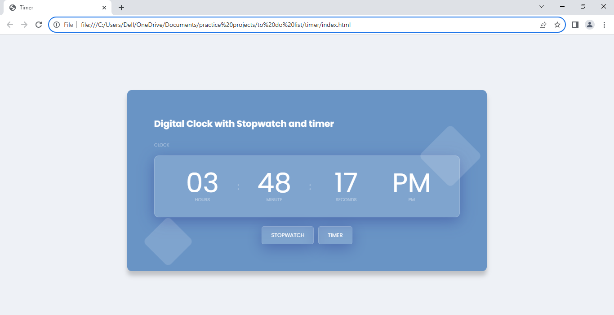
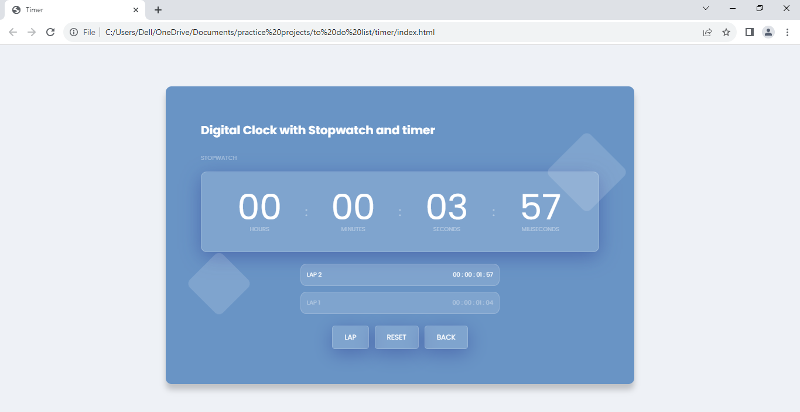
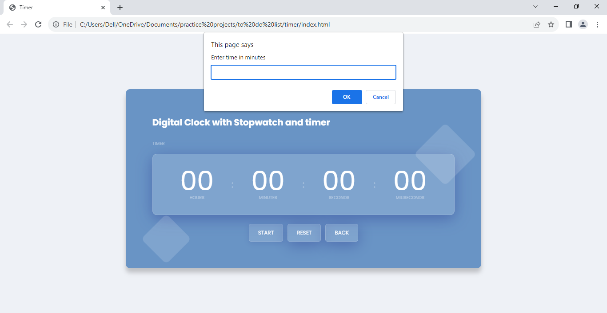

# A-Clock

  <b>Introducing a project of clock that has stopwatch and timer in it</b> 
  ⌚⏱⏲ 

  <b>The Clock</b> 
  This clock is more than just a timepiece, it's a versatile tool for measuring time in different ways
    

  

  
  <b>The Stopwatch</b> 
  💥 You can use the stopwatch to track your speed, performance, or progress in any activity 💥

  

  
  <b>The Timer</b> 
   You can use the timer to set alarms, reminders, or countdowns for any event

## License

MIT © Dakshita Jain
